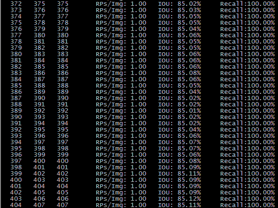

# IBM PowerAI人工智能12小时编程马拉松大赛——“我是大侦探” YOLO v2实现


赛事报道:[IBM PowerAI人工智能12小时编程马拉松大赛——“我是大侦探”成功落幕](http://www.csdn.net/article/a/2017-05-12/15927816)

题目：基于大量图片信息，分析并找出存在故意遮挡面部的人，为银行、宾馆、小区等需要视频监测的场景，提供嫌疑预判


训练好的weights文件,40000代结果(GTX 1080Ti上训练1000代时间大约为30分钟)

### 依赖
yolo v2，推荐[跨windows和linux的版本](https://github.com/AlexeyAB/darknet)

训练数据量:4045
测试数据量:405

评估结果:


### 依赖

```
git clone https://github.com/AlexeyAB/darknet
```

记下载到本地的路径为DARKNET_ROOT，把本工程置于DARKNET_ROOT下

### 训练
```
sh train.sh
```

### 测试单张图片
```
sh test.sh
```
### 评估测试集
```
sh evaluate.sh
```